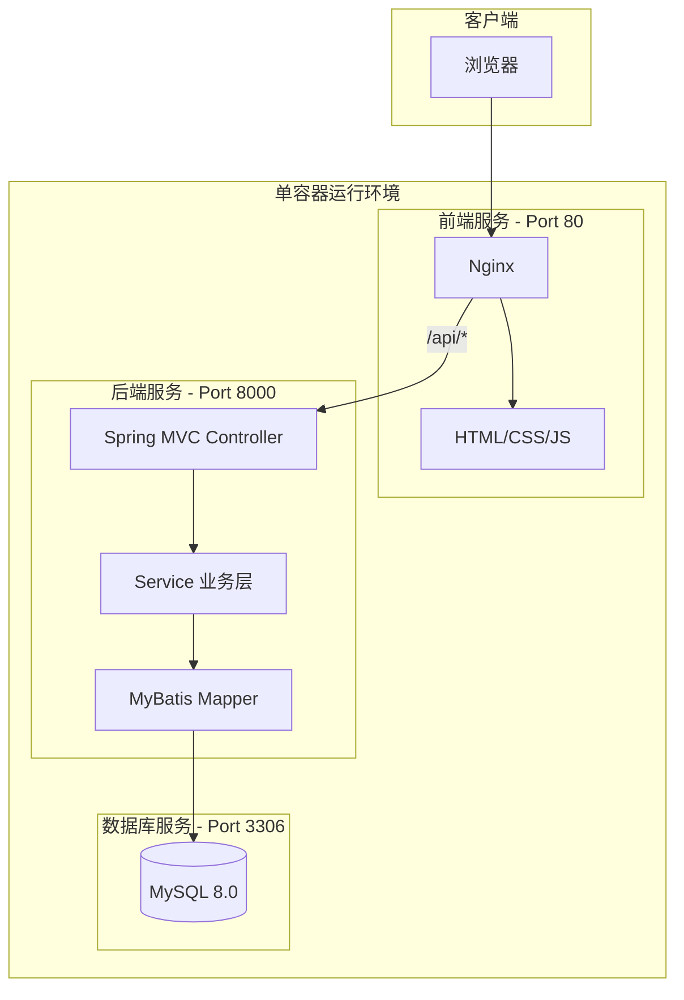
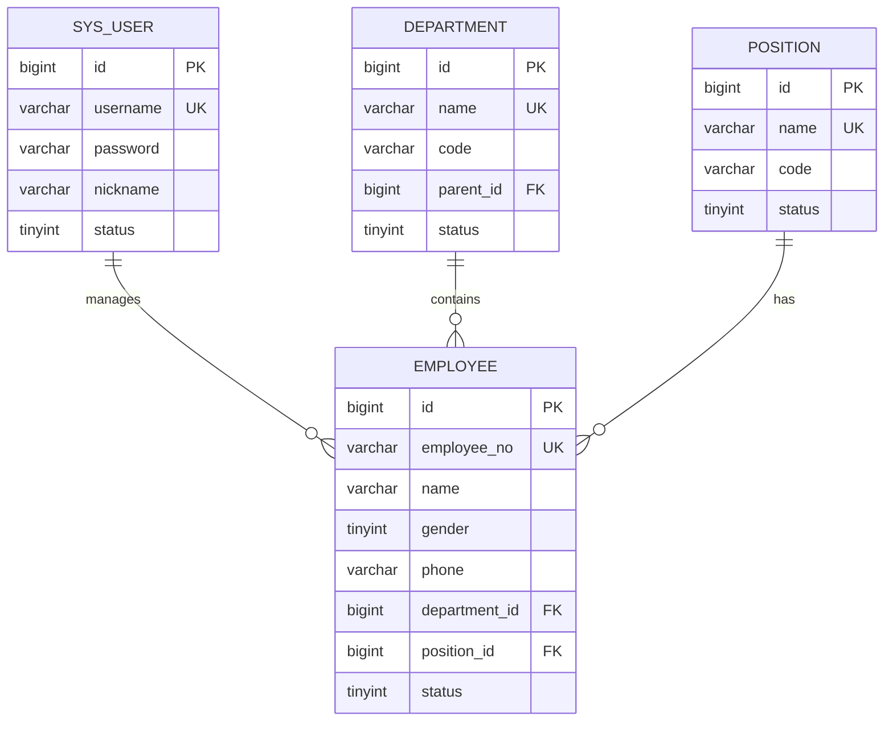

# 企业员工信息管理系统

> 🚀 **高效、安全的企业人力资源管理平台** - 采用三层架构设计，实现员工信息的集中化、数字化管理

---

## 📋 项目摘要

本系统是一个功能完整的企业员工信息管理平台，支持员工信息的增删改查、部门管理、职位管理，以及用户登录注册功能。采用前后端分离架构，后端提供 REST API，前端通过 Nginx 代理访问接口。

---

## 🏗️ 系统架构



---

## 🛠 技术栈

| 层级 | 技术 | 说明 |
|------|------|------|
| **Frontend** | HTML5 + CSS3 + JavaScript | 现代化响应式界面 |
| **Backend** | Spring Boot 2.7 + Spring MVC | 展现层与业务逻辑 |
| **ORM** | MyBatis | 数据访问层 |
| **Database** | MySQL 8.0 | 数据持久化 |
| **Auth** | JWT | 用户认证 |
| **Runtime** | JDK 17 + MySQL 8.0 + Nginx | 单容器运行环境 |
| **Web Server** | Nginx | 前端静态资源服务 |

---

## 🚀 快速启动

### 前置条件
- Docker Desktop 已安装并运行

### 启动步骤

1. **确保 Docker Desktop 已启动**

2. **在项目同级目录执行：**
   ```bash
   docker build -t ems-app .
   ```

3. **启动服务：**
   ```bash
   docker run --rm -p 3000:80 -p 8000:8000 ems-app
   ```

4. **等待服务启动完成**
   - 日志出现 `Started EmsApplication` 表示后端启动成功
   - 日志出现 `Frontend: http://localhost:3000` 后即可访问

5. **访问系统**

---

## 🔗 服务地址

| 服务 | 地址 |
|------|------|
| 🖥️ **Frontend** | http://localhost:3000 |
| ⚙️ **Backend API** | http://localhost:8000 |
| 🗃️ **Database** | 容器内 127.0.0.1:3306 (user: root / pass: root123) |

---

## 🧪 测试账号

| 账号 | 密码 | 角色 |
|------|------|------|
| **admin** | **123456** | 管理员 |

> 💡 系统已预置 20 名员工、10 个部门、12 个职位的示例数据

---

## 📱 功能介绍

### 🔐 用户认证
- 用户登录/注册
- JWT Token 认证
- 自动登录状态检测

### 📊 仪表盘
- 员工统计（总数、在职、离职）
- 部门/职位数量统计
- 快捷操作入口

### 👥 员工管理
- 员工列表（分页、搜索、筛选）
- 新增/编辑/删除员工
- 按部门、状态筛选

### 🏛️ 部门管理
- 部门卡片式展示
- 支持多级部门结构
- 新增/编辑/删除部门

### 💼 职位管理
- 职位列表展示
- 新增/编辑/删除职位

### 👤 个人中心
- 查看账号信息
- 退出登录

---

## 💾 数据库设计



---

## 📁 项目结构

```
企业员工信息管理系统/
├── README.md                 # 项目文档
├── backend/                  # 后端服务
│   ├── pom.xml              # Maven配置
│   └── src/main/
│       ├── java/com/enterprise/ems/
│       │   ├── EmsApplication.java      # 启动类
│       │   ├── controller/              # 控制器层
│       │   ├── service/                 # 业务层
│       │   ├── mapper/                  # 数据访问层
│       │   ├── entity/                  # 实体类
│       │   ├── dto/                     # 数据传输对象
│       │   ├── common/                  # 通用类
│       │   ├── config/                  # 配置类
│       │   ├── exception/               # 异常处理
│       │   ├── interceptor/             # 拦截器
│       │   └── util/                    # 工具类
│       └── resources/
│           ├── application.yml          # 应用配置
│           └── mapper/                  # MyBatis XML
├── frontend/                 # 前端服务
│   ├── nginx.conf           # Nginx配置
│   ├── index.html           # 主应用
│   ├── login.html           # 登录页
│   ├── register.html        # 注册页
│   ├── css/                 # 样式文件
│   └── js/                  # JavaScript
└── database/
    └── init.sql             # 数据库初始化
```

---

## 🔧 专业工程实践

### 1. 日志系统
- 使用 SLF4J + Logback 标准日志框架
- 结构化日志输出（时间戳、级别、模块）
- API请求日志记录
- 业务操作日志追踪

### 2. 错误处理
- 全局异常处理器 (`GlobalExceptionHandler`)
- 业务异常统一封装 (`BusinessException`)
- 前端 Toast 通知用户友好提示
- 表单验证错误提示

### 3. 数据校验
- 后端：使用 `@Valid` + Hibernate Validator
- 前端：表单提交前校验
- DTO 层严格参数验证

### 4. 接口设计
- RESTful API 规范
- 统一响应格式 (`Result<T>`)
- JWT Token 认证
- CORS 跨域支持

### 5. 生产级特性

| 特性 | 状态 | 说明 |
|------|------|------|
| ✅ 响应式布局 | 已实现 | 支持PC和移动端 |
| ✅ 数据持久化 | 已实现 | MySQL 初始化数据 |
| ✅ 模块化设计 | 已实现 | 三层架构清晰分离 |
| ✅ 错误边界 | 已实现 | 全局异常处理 |
| ✅ 用户反馈 | 已实现 | Toast/Modal组件 |
| ✅ 输入校验 | 已实现 | 前后端双重验证 |
| ✅ 数据初始化 | 已实现 | 自动Seed示例数据 |
| ✅ 容器化 | 已实现 | Docker一键部署 |

---

## ⚠️ 常见问题

**Q: Docker 构建很慢？**  
A: 首次构建需下载依赖，请耐心等待。后续构建会使用缓存加速。

**Q: 端口被占用？**  
A: 确保 3000 和 8000 端口未被占用，或在 `docker run` 时调整端口映射。

**Q: 数据库连接失败？**  
A: 等待日志中出现 MySQL 启动信息，后端会在同一容器内连接本地数据库。

---

## 📄 License

MIT License
